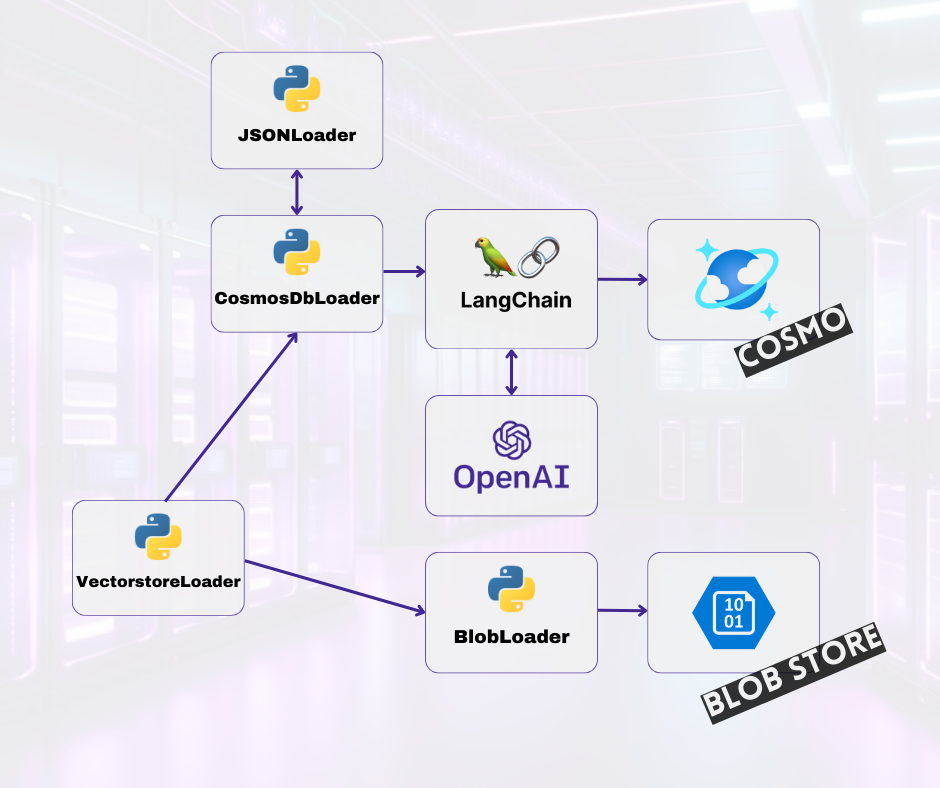

# Project Description: Loading Documents into Cosmos DB for MongoDB VCore Vector Store

## Overview
This project aims to demonstrate the process of loading documents into a Cosmos DB for MongoDB VCore Vector Store using LangChain Loaders, while also loading images into an Azure Storage Account. Please view the tutorial walk-through: [LangChain RAG with React, FastAPI, Cosmos DB Vector: Part 1](https://stochasticcoder.com/2024/02/27/langchain-rag-with-react-fastapi-cosmos-db-vector-part-1/).



## Features
- Integration of LangChain Loaders for seamless document loading into Cosmos DB for MongoDB VCore Vector Store.
- Utilization of Azure Storage Account for efficient storage and retrieval of images associated with the documents.
- Demonstrates how to set up and configure the environment for document and image loading tasks.

## Requirements
- Azure subscription for deploying Cosmos DB for MongoDB VCore and Azure Storage Account.
- Python environment with LangChain and Azure SDK installed.
- Basic knowledge of MongoDB, Azure Cosmos DB, and Azure Storage concepts.

## Usage
1. Set up Cosmos DB for MongoDB VCore and Azure Storage Account in your Azure subscription.
2. Clone the repository to your local machine.
3. Create **.env** file and populate:
- OPENAI_API_KEY=''
- MONGO_CONNECTION_STRING=''
- AZURE_STORAGE_CONNECTION_STRING=''
4. Create pythonn env: 
```
python -m venv venv
```
5. Install Requirements:
```
venv\Scripts\activate
python -m pip install -r requirements.txt
```
6. Load sample docuemtns [vectorstoreloader.py](vectorstoreloader.py)
```
python vectorstoreloader.py
```


## License
This project is licensed under the [MIT License](../MIT.md), granting permission for commercial and non-commercial use with proper attribution.

## Support
For any questions or issues, please [open an issue](https://github.com/jonathanscholtes/LangChain-RAG-Pattern-with-React-FastAPI-and-Cosmos-DB-Vector-Store/issues) on GitHub or reach out to the project maintainers.

## Disclaimer
This project is provided for educational and demonstration purposes only. Use at your own risk.

