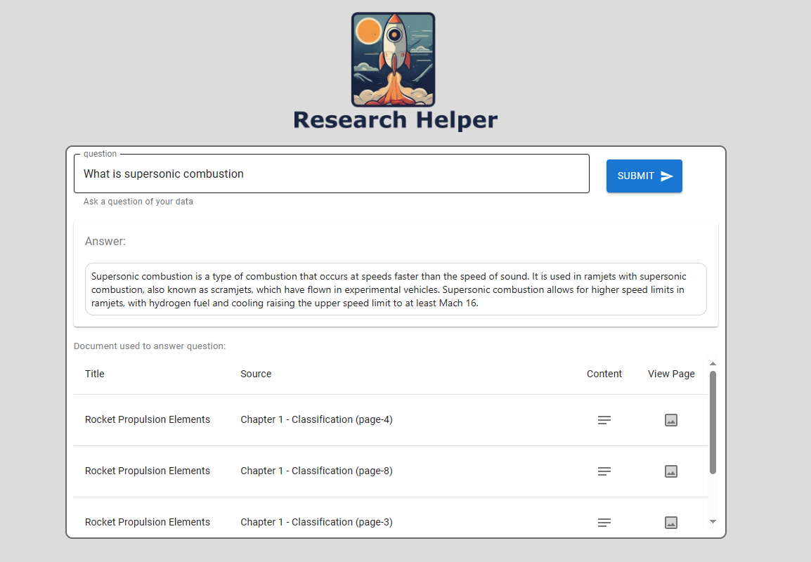

# React for LangChain RAG Pattern with FastAPI

## Overview
This React project utilizes Node.js  to connect to a FastAPI backend for implementing the LangChain RAG (Retrieval Augmented Generation) pattern for Question and Answer (Q&A) tasks. [LangChain RAG with React, FastAPI, Cosmos DB Vector Search: Part 3](https://stochasticcoder.com/2024/03/06/langchain-rag-with-react-fastapi-cosmos-db-vectors-part-3/).

## Features
- Utilizes React for building a modern and interactive user interface.
- Integrates Node.js for server-side logic and connecting to the FastAPI backend.
- Implements the LangChain RAG pattern for advanced Q&A tasks, enabling intelligent question answering.
- Utilizes FastAPI for building a high-performance backend API.

## Requirements
- Node.js 20.11.1 installed in your development environment.
- Access to a FastAPI backend for LangChain RAG pattern implementation.
- Basic knowledge of React, Node.js, FastAPI, and LangChain concepts.

## Usage
1. Clone the repository to your local machine.
2. Set up and configure the FastAPI backend for LangChain RAG pattern implementation.
3. Create **.env** file and populate:
- REACT_APP_API_HOST=http://127.0.0.1:8000
4. Perform a clean install of package dependancies:
```
npm ci
```
4. Start the Node.js server and run the React 18 application to interact with the LangChain RAG Q&A functionality.
```
npm start
```



## License
This project is licensed under the [MIT License](../MIT.md), granting permission for commercial and non-commercial use with proper attribution.

## Support
For any questions or issues, please [open an issue](https://github.com/Jscholtes128/LangChain-RAG-Pattern-with-React-FastAPI-and-Cosmos-DB-Vector-Store/issues) on GitHub or reach out to the project maintainers.

## Disclaimer
This project is provided for educational and demonstration purposes only. Use at your own risk.
